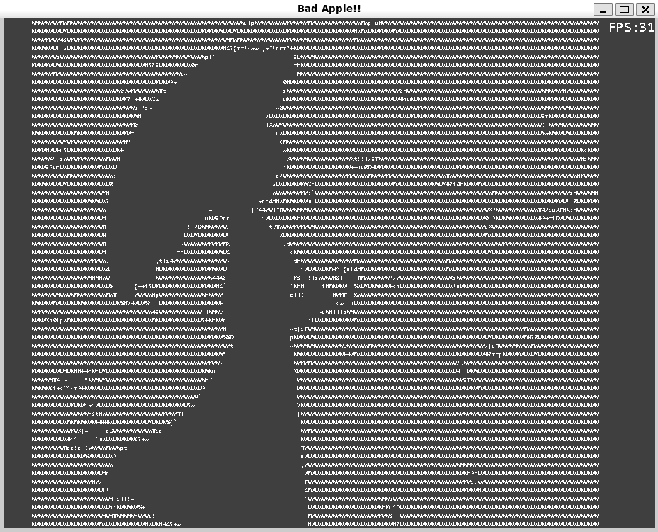

# BadApple_SDL

===============

一个基于SDL库的BadApple动画

----------------------------------------------

An "Bad Apple!!"Anime based SDL lib

编译说明：

首先在common.h中的修改适合的长宽和字符大小

安装依赖库
>SDL SDL_mixer SDL_ttf SDL_image

Linux下使用cmake编译



PRETTY_NAME="Debian GNU/Linux 13 (trixie)"

```bash
sudo apt update
sudo apt install build-essential cmake \
  libsdl1.2-dev \
  libsdl-image1.2-dev \
  libsdl-mixer1.2-dev \
  libsdl-ttf2.0-dev
```

```bash
    mkdir build
    cd build
    cmake ../
    make
    ./badapple
```

使用说明：

空格可暂停/恢复
